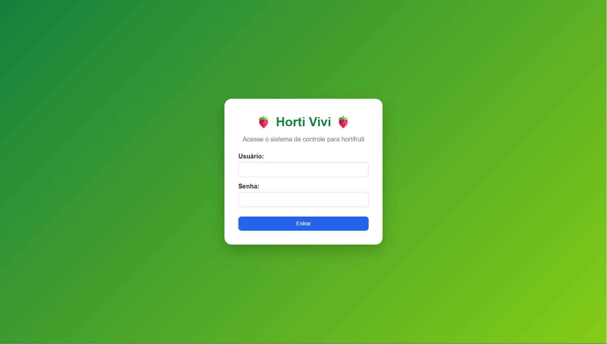
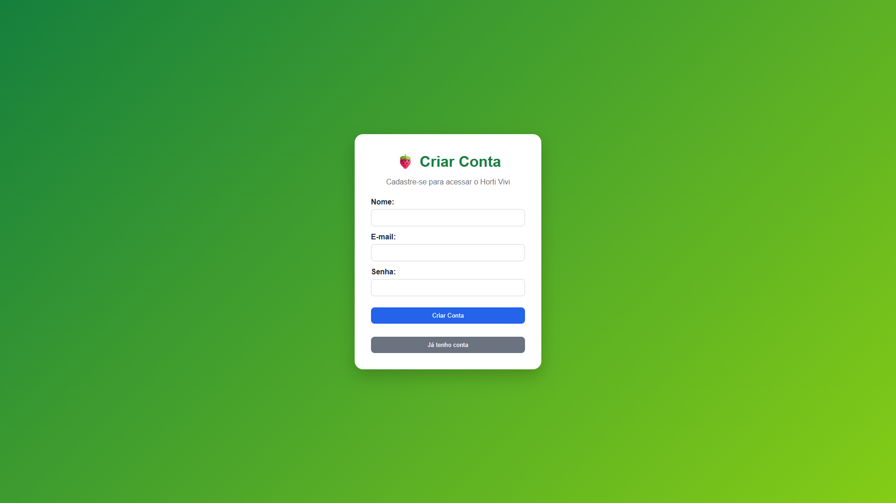
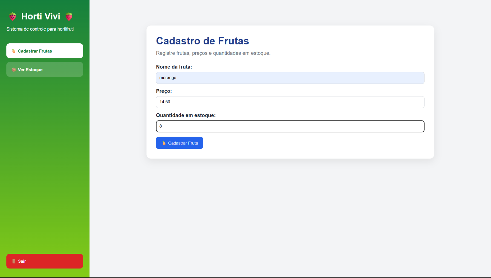
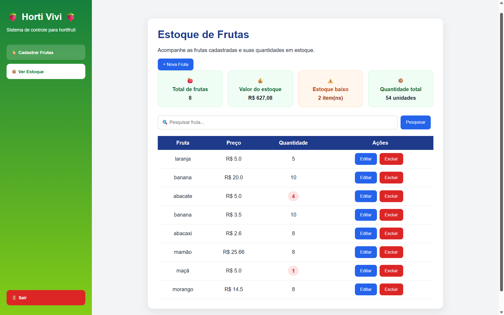
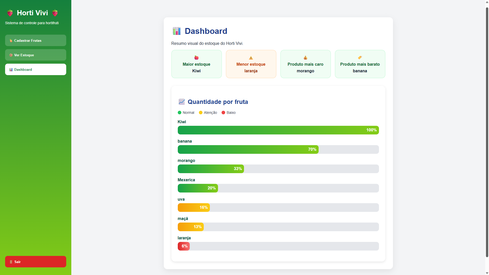

# 🍓 Horti Vivi

Sistema de gerenciamento de estoque para hortifrúti desenvolvido em Java utilizando JSF, JPA, Hibernate e PostgreSQL.

## 📋 Sobre o projeto

O Horti Vivi é um sistema web de gerenciamento de estoque para hortifrúti desenvolvido em Java utilizando JSF, JPA, Hibernate e PostgreSQL.

O sistema permite o cadastro e autenticação de usuários, gerenciamento completo de produtos, controle de estoque e visualização de indicadores através de um dashboard interativo.

Inicialmente criado como projeto acadêmico da disciplina de Tecnologia Web, o sistema vem sendo continuamente aprimorado para fins de aprendizado e desenvolvimento profissional, incorporando recursos encontrados em aplicações reais de gestão.

## 🚀 Funcionalidades

- Cadastro de usuários
- Login com autenticação por e-mail e senha
- Cadastro de frutas
- Consulta de estoque
- Edição de produtos cadastrados
- Exclusão de produtos
- Pesquisa de produtos
- Dashboard gerencial
- Indicadores de estoque
- Produto com maior estoque
- Produto com menor estoque
- Produto mais caro
- Produto mais barato
- Gráfico visual de estoque
- Interface responsiva e intuitiva

## 🛠️ Tecnologias utilizadas

- Java 17
- JSF (Jakarta Faces)
- JPA
- Hibernate ORM
- PostgreSQL
- Maven
- Apache Tomcat
- HTML5
- CSS3

## 📂 Estrutura do projeto

```text
src/
 ├── main/
 │   ├── java/
 │   ├── resources/
 │   └── webapp/
 └── test/
```

## ⚙️ Como executar localmente

### Pré-requisitos

- JDK 17
- PostgreSQL
- Apache Tomcat 10
- Maven

### Passos

1. Clone o repositório:

```bash
git clone https://github.com/ivivisz/horti-vivi.git
```

2. Configure o banco PostgreSQL.

3. Execute o Maven:

```bash
mvn clean package
```

4. Faça o deploy do arquivo `.war` no Tomcat.

5. Acesse:

```text
http://localhost:8080/crud-produtos
```

## 📸 Telas do sistema

### 🔐 Login



### 👤 Cadastro de Usuário



### 🍓 Cadastro de Frutas



### 📦 Estoque



### 📊 Dashboard



## 🌐 Acesso Online

O sistema está disponível em:

https://horti-vivi.onrender.com

### 👩‍💻 Desenvolvedora

**Vitória Cristine**

Estudante de Sistemas de Informação e desenvolvedora do projeto Horti Vivi.

GitHub: @ivivisz

## 🎯 Aprendizados

Durante o desenvolvimento deste projeto foram aplicados conceitos de:

* Programação Orientada a Objetos (POO)
* Arquitetura MVC
* Persistência de dados com JPA e Hibernate
* Banco de dados PostgreSQL
* Desenvolvimento Web com JSF
* Controle de sessão e autenticação
* Hospedagem de aplicações Java no Render
* Versionamento de código com Git e GitHub

## 📄 Licença

Projeto desenvolvido para fins acadêmicos e de estudo.
